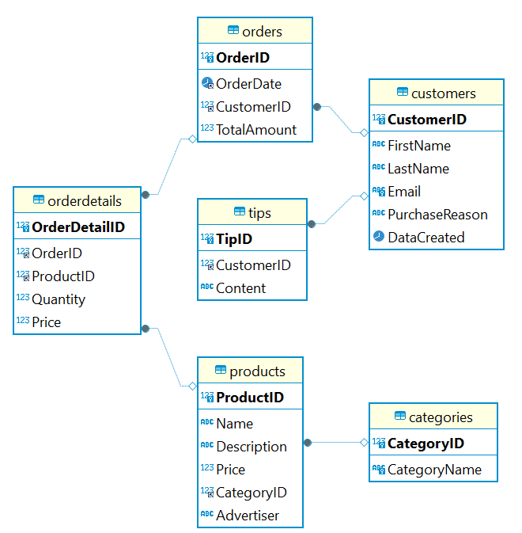

# midterm modulo 2 Bases de datos.
## Por: Manuel Alejandro Garcia Rojas.

Soy Estudiante de Ironhack, vivo en Vilanova I la Geltrú, soy de Colombia, estudie Marketing e investigacion de mercados y Marketing digital, inicie un grado superior en DAW el cual no termine, pero me dejo bases y muchas ganas de aprender todo lo relacionado a este mundo dela programacion y el desarrollo de aplicaciones web y espero que este proyecto sea el primer paso de algo grande.

### Proyecto:
## PequeShop

PequeShop es una pagina web que vende productos para niños menores de 5 años, los productos que vende están divididos en 4 categorías:
-	Ropa (deportiva – formal – informal- pijamas).
-	Zapatos (Tenis deportivos – zapatos formales – sandalias).
-	Juguetes (de marcas como  Fisher Price, lego etc..)
-	Libros (Cuentos para niños – de colorear – para los padres – trucos - recetas).

No se maneja stock ni se tiene mercancía, la modalidad de negocio es 100% por marketing de afiliados, en donde grandes marcas como:
-	El corte inglés.
-	Fisher Price.
-	Amazon.
-	Nike, Adidas, puma.
-	Benetton.

Son quienes realmente venden y distribuyen los productos, Pequeshop solo recibe la comisión por venta que realiza desde su sitio web.

### Creación de la base de datos:

El objetivo de la base de datos es principalmente tener almacenados los datos de los clientes para segmentarlos, de tal manera que podamos hacerles campañas de marketing, hacer promociones y crear una comunidad que se ayude entre si con concejos de paternidad y de la crianza, específicamente a padres primerizos.

### 1. Crear una base de datos llamada BabyStore.

### Tablas:

Para este proyecto vamos a crear una base de datos que llamaremos Baby Store, la cual esta compuesta por 5 tablas normales y una tabla intermedia llamada categories, que nos ayuda a normalizar la columna de categories de la tabla products.
Se agregan índices en las columnas que se utilizan frecuentemente en consultas para mejorar el rendimiento. (INDEX)

Customers: Información sobre los clientes. 
Products: Información sobre los productos. 
Categories: tiene contenida la categoria del producto para segmentarlo. 
Orders: Información sobre los pedidos realizados por los clientes. 
OrderDetails: Información detallada de los productos incluidos en cada pedido. 
Tips: Consejos para padres primerizos proporcionados por otros clientes. 

### Relaciones entre tablas:

One-to-One: Relación entre Customers y Tips (cada cliente puede dejar un único tip). 
One-to-Many: Relación entre Customers y Orders (un cliente puede hacer múltiples pedidos). 
Many-to-Many: Relación entre Products y Orders a través de OrderDetails. 
Bidireccional: Implementaremos las relaciones para que puedan ser navegadas en ambas direcciones. 

### Consultas y funcionalidades:

Creación de consultas simples y complejas. 
Triggers para mantener integridad y consistencia de datos. 
Uso de transacciones para operaciones críticas. 
Definición de funciones personalizadas. 